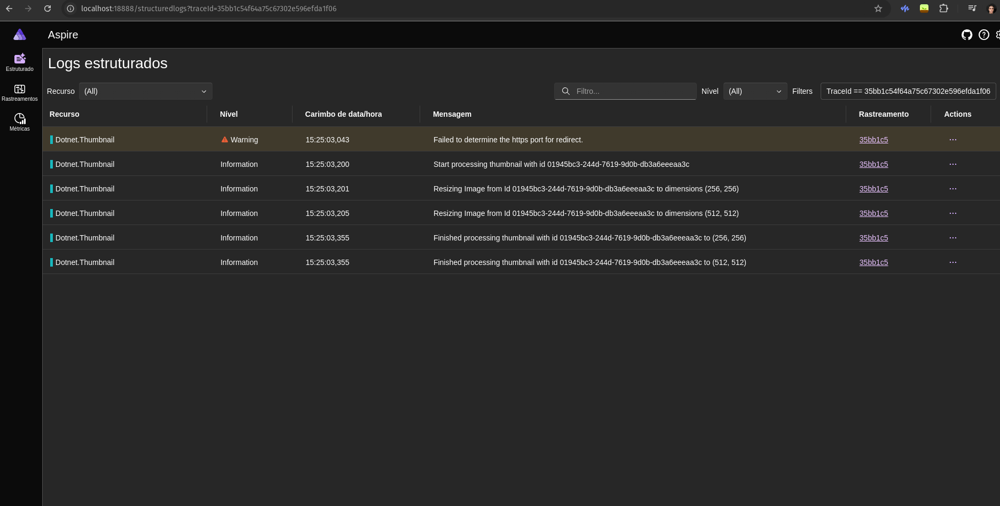

# Dotnet.Thumbnail

This project was created to explore the Telemetry in scenarios where we have async process and to see how the behaviour(it's amazing btw)

**Everything is running in memory**

## Idea


## Running the project

```sh
docker-compose up 
```

This will setup the API, Minio Containers, the telemetry dashboard using Aspire Dashboard in standalone

## Telemetry

### Aspire Dashboard

Put in the environment variable (or appsettings.json):
```json
{
  "OTEL_EXPORTER_OTLP_ENDPOINT": "http://localhost:4317"
}
```

### New Relic

```json 
{
  "OTEL_EXPORTER_OTLP_ENDPOINT": "https://otlp.nr-data.net",
  "OTEL_EXPORTER_OTLP_HEADERS": "api-key=api-key"
}
```


## Results

The overview experience was good, it was simple to setup the telemetry and to send it, I noticed that for some cases where we have an unexpected exception for some reason the logs or traces aren't being sent using telemetry, I don't know what is...

#### Tracing


#### Logs related




## Pending Things to do

- [ ] Persist the data in a database
- [ ] Add telemetry to the persistence


Since this is a simple POC, I don't have the intention to add tests.

## Telemetry code

```csharp
using OpenTelemetry;
using OpenTelemetry.Metrics;
using OpenTelemetry.Trace;

// ... rest of the code
public static IHostApplicationBuilder ConfigureTelemetry(this IHostApplicationBuilder builder)
{
    builder.Logging.AddOpenTelemetry(logging =>
    {
        logging.IncludeScopes = true;
        logging.IncludeFormattedMessage = true;
    });
    builder.Services.AddOpenTelemetry().WithTracing(tracing =>
            tracing.AddAspNetCoreInstrumentation().AddHttpClientInstrumentation()
        )
        .WithMetrics(metrics => metrics.AddAspNetCoreInstrumentation().AddRuntimeInstrumentation()
        )
        .UseOtlpExporter();
    return builder;
}
```